# Making Animated Anchored Mural Elements

This document is aimed at explaining some of the existing interactions available in the app. There is more development on the way that will support adding in new images, but for now we have an already installed set which will work in the space

## General process

An animated layer is created in the following steps,
* For each mural element
    * Place animated element over their corresponding static real world element
    * Resize/Reposition to suit 
    * "Anchor" the element to ensure it's placement stays when someone else loads the experience later
* Generate a virtual background to prevent confusion
    * place the 4 furthest points (making a bounding box)
    * add the intermediate points that help "cut out" real world objects you don't want masked
    * select 3 points to make a "triangle" of virtual background 
    * repeat until the rest of the mural is hidden
    * modify any points who's texture looks incorrect
    * "Anchor" the points  so it will automatically appear on reload

The rest of the document exists to explain "How" to perform these steps in the application with the right quest 3 controller

## Types of Animation interaction

### Placing Elements

Point at one of the animations you'd like to use
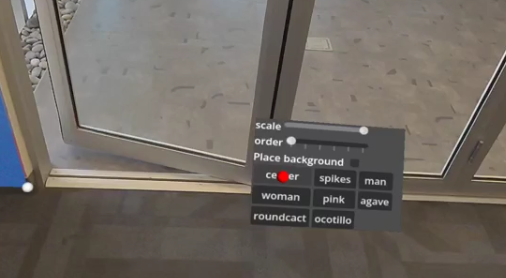

Choose a part of the wall
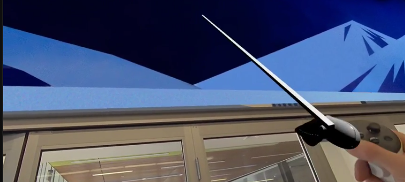

Press the trigger on the back of the controller

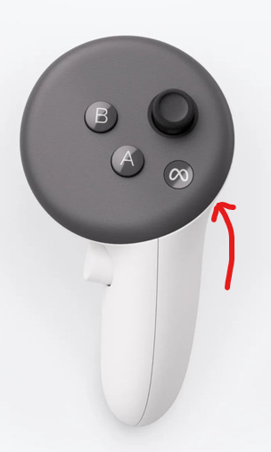

You may "reposition" the element by pointing at the element and pressing the trigger again, to delete. then pick a new area to re-place it. 

### Tweaking Elements

After placing an element point at the element and press "B" to mark the element for modification

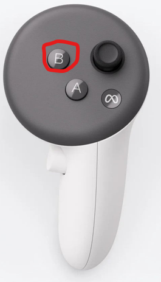

Then use the trigger in the interface to change the "front to back order" of overlapping elements or the "scale" to make it bigger or smaller

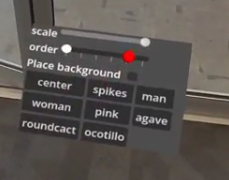

When you're done, point at the element and press "A" on the controller to "Anchor" the element and it's changes

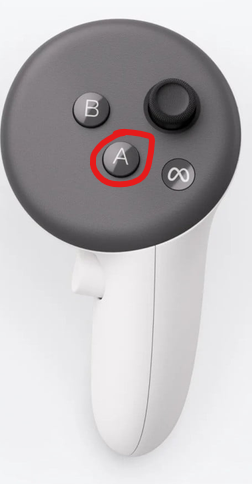

## Types of Background Interaction

### Creating your bounding points

Use the trigger in the interface to toggle the check box for "Place Background". You will see new options appear in the interface

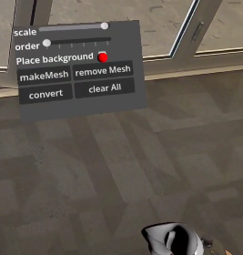

Now when you target the wall and press "A" it will add a 3d vertex/point.

Add 4 of these at the "Top Left" "Top Right" "Bottom Left" and "Bottom Right" corners of the space. These make up the boundary of your area

### Intermediate points

Now add points that help to "clip" around parts of the wall you don't want a virtual background to cover

### Making triangles

Once you have all your vertices/points, you will start selecting them in groups of three pressing the "B" button.

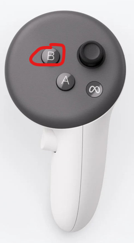

 The point will turn red when you're selecting the point, and will stay red after pressing "B" to indicate it's part of the group

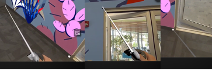

Upon selecting the 3rd point, a triangle will appear

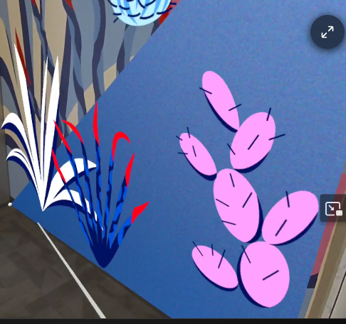
### Stretching Texture

If the texture doesn't look quite right, you can point the controller at a point, and use the "Joystick" to nudge the image in the direction you want. 

NOTE, this is a feature in development and is known to sometimes act "in reverse" of what you want in the horizontal direction. 

### Converting Background to anchors

Once you've made your background and stretched it to look the way you want, you can "convert" its points to anchors.

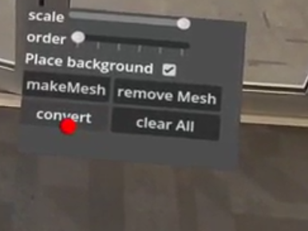

They will all receive a little pink box around them and then you can close and re-open the application and the entire virtual background should still be visible.

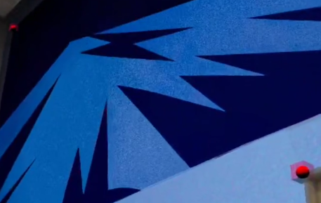